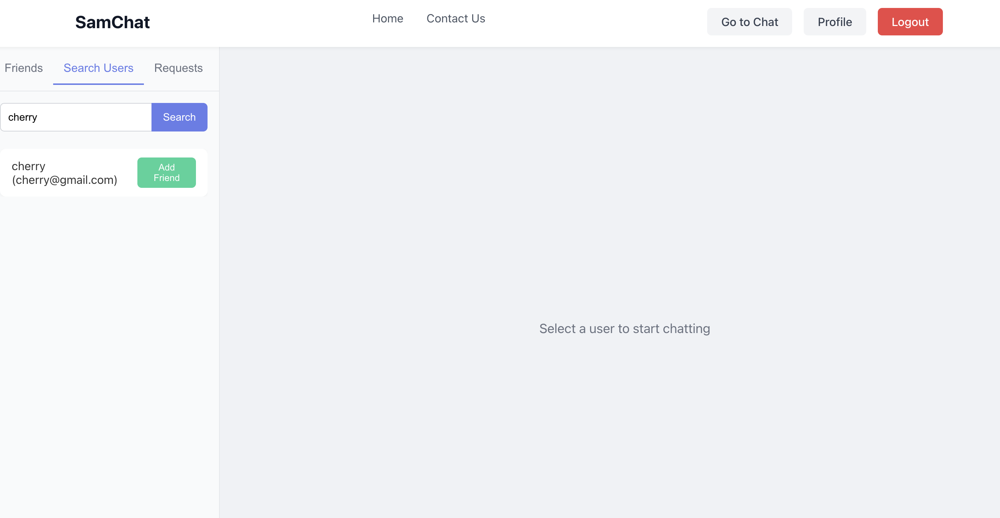

# SamChat - Real-Time Chat Application

A modern, feature-rich chat application built with the MERN stack (MongoDB, Express.js, React.js, Node.js) and Socket.IO for real-time communication.

## Features

- 🔐 User Authentication (Login/Register)
- 💬 Real-time messaging
- 👥 Friend requests system
- 🔔 Desktop notifications
- 📱 Responsive design
- 👤 User profiles
- 🟢 Online/Offline status
- 🗑️ Clear chat history option

## Screenshots

### Login Page


### Chat Interface


### Friend Requests


### User Search


### Profile Page


### Mobile View


### Notifications


## Quick Start

### Prerequisites
- Node.js (v14 or higher)
- MongoDB
- npm or yarn

### Installation

1. Clone the repository:
```bash
git clone https://github.com/Samskruthi020/SamChat.git
cd SamChat
```

2. Install server dependencies:
```bash
npm install
```

3. Install client dependencies:
```bash
cd client
npm install
```

4. Create a `.env` file in the root directory:
```
MONGODB_URI=your_mongodb_uri
JWT_SECRET=your_jwt_secret
PORT=5001
```

5. Start the development servers:

In the root directory:
```bash
# Start the backend server
npm start
```

In the client directory:
```bash
# Start the frontend server
npm start
```

The application will be available at `http://localhost:3000`

## Technologies Used

- **Frontend**: React.js, Socket.IO-client, CSS3
- **Backend**: Node.js, Express.js, Socket.IO
- **Database**: MongoDB
- **Authentication**: JWT (JSON Web Tokens)

## License

This project is licensed under the MIT License - see the [LICENSE](LICENSE) file for details.

## Author

Shaganti Samskruthi 